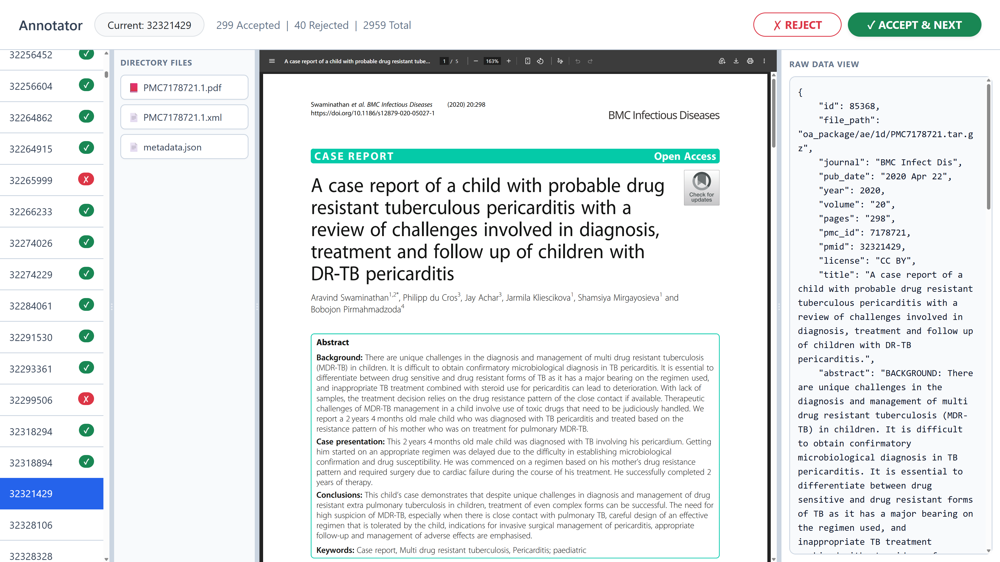

# Case Report Benchmark Pipeline

This project aims to create a comprehensive benchmark dataset for medical case reports.

Our primary data source is the PubMed Central (PMC) Open Access (OA) subset. We begin by downloading the complete archive index and subsequently extract and process the data to isolate case reports for downstream data mining and analysis.

## 0. Dataset Preparation (Optional but recommended)

> ⚡️⚡️⚡️**Save Time:** You can skip the manual processing described in **Steps 1 through 4** by downloading the pre-processed database files directly. This is the recommended path if you want to start inspecting or using the data immediately.

### Step 1: Download Files

Access the pre-processed data via the Google Drive link below:
👉 **[Download Pre-processed Data](https://drive.google.com/drive/folders/1mT9b6NhcuxPMTQSvm0WSqFtExSoADJP3?usp=sharing)** (30GB)

### Step 2: Setup Directory

Place the downloaded files into a directory named `./data` at the root of the project. Your directory structure should look like this:

```text
data/
├── download_files.zip       # Contains ~3000 PDFs with XML, images, and metadata
├── keyword_filtered.db
├── llm_filtered.db
├── oa_file_list.txt
├── source_metadata.db
└── title_abstract_db/
    ├── pub_abstracts_2000.db
    ├── ...
    └── pub_abstracts_2026.db

2 directories, 32 files
```

### Step 3: Extract Data

Run the following command to unzip the PDF archive into the data folder:

```bash
unzip -o data/download_files.zip -d data
```

### Step 4: Data Inspection & Verification

Once the databases are in place, use the provided inspection scripts to verify the data integrity and explore the contents of each SQLite database.

| Script | Purpose |
| --- | --- |
| `read_metadata_db.py` | Inspect general source metadata for all records. |
| `read_title_abstract_db.py` | View extracted titles and abstracts (2000–2026). |
| `read_keyword_based_db.py` | Review files identified through keyword matching. |
| `read_llm_filtered_db.py` | Inspect the final LLM-refined dataset. |

Execute any of the scripts from the root directory to see a sample of the data:

```bash
# Example: Inspect the keyword-filtered database
python3 read_keyword_based_db.py
```

## 1. Prepare the Data

The first step is to download the index of all available OA articles from the NCBI FTP server. This file (`oa_file_list.txt`) is approximately 786MB.

```bash
mkdir -p data
curl -o data/oa_file_list.txt https://ftp.ncbi.nlm.nih.gov/pub/pmc/oa_file_list.txt
```

The raw text file contains metadata for each article in the following format:

```text
2026-03-06 21:31:45
oa_package/08/e0/PMC13900.tar.gz    Breast Cancer Res. 2001 Nov 2; 3(1):55-60   PMC13900    PMID:11250746   NO-CC CODE
....
oa_package/f6/9d/PMC12904753.tar.gz J Neurol Surg Rep. 2026 Feb 13; 87(1):e17-e18   PMC12904753     CC BY
```

To make this metadata easier to process and query, we convert the text file into a SQLite database. Run the following script to generate the database:

```bash
python3 create_metadata_db.py
```

You can verify the database was created successfully and inspect its contents by running:

```bash
python3 read_metadata_db.py
```

## 2. Retrieve Titles and Abstracts

To identify and extract case reports, we first need to retrieve the title and abstract for each article using its PubMed ID (PMID). **Note: This is very time consuming!**

Run the following script to fetch the titles and abstracts and store them in the dataset:

```bash
python3 retrieve_title_abstract.py
```

Once the retrieval is complete, you can inspect the newly populated database (organized by year) to verify the results:

```bash
python3 read_title_abstract_db.py
```

### Example Output

Running `read_title_abstract_db.py` will generate a report similar to the one below:

```text
📊 Database Report
==================================================
File: pub_abstracts_2021.db
Total records in DB: 690,070
Randomly sampling 5 records (Seed: 42)...

--- SAMPLE #1 (Internal ID: 26226) ---
id        : 26226
file_path : oa_package/fa/e9/PMC7812405.tar.gz
journal   : J Int Med Res
pub_date  : 2021 Jan 14
year      : 2021
volume    : 49(1)
pages     : 0300060520982814
pmc_id    : 7812405
pmid      : 33445995
license   : CC BY-NC

title:
Spermatorrhea in a Chinese patient with temporal lobe epilepsy: a case report.

abstract:
Epilepsy is a chronic neurological disorder that is characterized by episodes of seizure. Sexual dysfunction has been reported in patients with seizure, which mostly manifests as erectile dysfunction and premature ejaculation in men. In this study, we report the case of a 65-year-old Chinese man with frequent spermatorrhea. Electroencephalography suggested local epilepsy in the left temporal lobe. After treatment with anti-epilepsy drugs, the symptoms disappeared and did not recur. To the best of our knowledge, this is the first reported case of epilepsy-induced spermatorrhea. The symptoms of spermatorrhea are probably a rare manifestation of seizure. When repetitive stereotyped symptoms occur, seizure should be considered, and tentative anti-epileptic treatment may be a good option.
============================================================
...
```

## 3. Automated Filtering via LLM

To identify case reports from the massive PMC archive, we employ LLM (qwen2.5-3b) to analyze the retrieved titles and abstracts, and we filter out different levels of case report. We use 24GB 4090 with a bs of 64, you may need to adjust the batch size depending on your GPU memory. Run the filtering script to process the database:

```bash
# you may read this script's prompt to have a quick view of what we classify (line 85 ~ line 106)
python3 llm_filter.py
```

### Reviewing Results

Once the LLM has flagged the relevant articles, you can inspect the filtered dataset using:

```bash
python3 read_llm_filtered_db.py
```


## 4. Download the pdf files

We can use the filtered database to download the pdf files of case reports.
```bash
python3 download_files.py
```

## 5. Choose the golden standard 1k case reports

We write a simple script using a web application to choose the gold standard 1,000 case reports from `data/download_files` (a subset of case reports downloaded with `download_files.py` from the years 2020–2026).

```bash
python3 annotate.py
```

The web page look like this:

The results is saved at `log/progress.txt`.