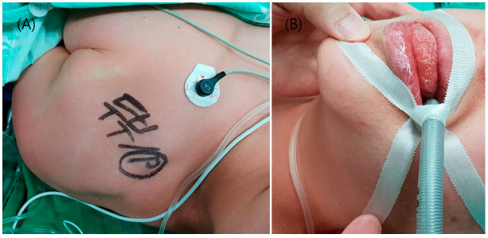
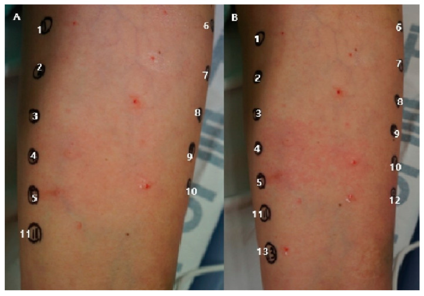

# Title: Anaphylaxis Induced by Rocuronium in a Patient with Pituitary Macroadenoma: A Case Report and Review of Neuromuscular Blocking Agent Allergies

## Abstract

This case report describes a 57-year-old woman with a pituitary macroadenoma who experienced anaphylaxis following the administration of rocuronium during surgery. The patient presented with tachycardia, hypotension, generalized urticaria, and tongue edema. A skin prick test confirmed rocuronium as the allergen, while cisatracurium was negative. The surgery was postponed, and epinephrine was administered. Two weeks later, the patient underwent successful reoperation with cisatracurium without adverse events. This case highlights the importance of identifying neuromuscular blocking agent allergies and selecting alternative agents to prevent perioperative anaphylaxis.

## 1. Introduction

Pituitary macroadenomas are benign tumors larger than 10 mm that arise from the pituitary gland, often causing hormonal imbalances and requiring surgical intervention. The prevalence of pituitary adenomas is approximately 77 per 100,000 individuals, with macroadenomas accounting for a significant proportion due to their size and symptomatic presentation [1]. Neuromuscular blocking agents (NMBAs) like rocuronium are commonly used during anesthesia to facilitate intubation and surgery. However, NMBAs are also known to cause hypersensitivity reactions, including anaphylaxis, with an incidence ranging from 1 in 5,000 to 1 in 10,000 anesthetic procedures [2]. This report discusses a case of rocuronium-induced anaphylaxis, emphasizing the diagnostic and management strategies for NMBA allergies.

## 2. Case Presentation

A 57-year-old woman with a known pituitary macroadenoma was scheduled for surgical resection. Her medical history included urticaria triggered by pollen and contrast agents. During induction of anesthesia, rocuronium was administered, resulting in an immediate increase in pulse rate to 120 beats/min and a drop in blood pressure to 77/36 mmHg. The patient developed generalized urticaria and tongue edema, indicative of an anaphylactic reaction.

Emergency management included the administration of epinephrine, leading to stabilization of vital signs. The surgery was postponed, and a skin prick test conducted four days later confirmed rocuronium as the causative agent (Figure 1). Cisatracurium, tested as an alternative, showed no allergic reaction (Figure 2). The patient was reoperated on two weeks later using cisatracurium without complications and was discharged seven days postoperatively.

> **Figure 1:** Clinical presentation of the patient showing generalized urticaria and tongue edema following rocuronium administration.

> **Figure 2:** Skin prick test results. (A) Positive reaction to rocuronium. (B) Negative reaction to cisatracurium.

## 3. Discussion

This case underscores the critical need for vigilance regarding NMBA-induced anaphylaxis, particularly in patients with a history of allergic reactions. Rocuronium, a non-depolarizing NMBA, is frequently implicated in perioperative anaphylaxis due to its quaternary ammonium structure, which can trigger IgE-mediated hypersensitivity [3]. The immediate onset of symptoms following administration highlights the importance of rapid recognition and intervention.

The negative skin prick test for cisatracurium provided a safe alternative for subsequent anesthesia, aligning with literature suggesting lower allergenic potential among different NMBAs [4]. The successful reoperation without adverse events confirms the efficacy of preoperative allergy testing in guiding anesthetic choices.

This case contributes to the medical community by reinforcing the necessity of preoperative allergy assessments in patients with known hypersensitivities. It also emphasizes the role of alternative NMBAs in preventing anaphylactic events, thereby improving patient safety and surgical outcomes.

## 4. Conclusions

Rocuronium-induced anaphylaxis is a significant perioperative risk that requires prompt identification and management. This case illustrates the utility of skin prick testing in diagnosing NMBA allergies and selecting safe alternatives. Clinicians should maintain a high index of suspicion for NMBA-related anaphylaxis, particularly in patients with a history of allergies, to optimize perioperative care and patient safety.

## References

1. Ezzat S, Asa SL, Couldwell WT, et al. The prevalence of pituitary adenomas: a systematic review. Cancer. 2004;101(3):613-619.
2. Mertes PM, Laxenaire MC, Alla F. Anaphylactic and anaphylactoid reactions occurring during anesthesia in France in 1999-2000. Anesthesiology. 2003;99(3):536-545.
3. Dewachter P, Mouton-Faivre C, Emala CW. Anaphylaxis and anesthesia: controversies and new insights. Anesthesiology. 2009;111(5):1141-1150.
4. Dong SW, Mertes PM, Petitpain N, et al. Hypersensitivity reactions during anesthesia. Results from the ninth French survey (2005-2007). Ann Fr Anesth Reanim. 2011;30(3):223-233.