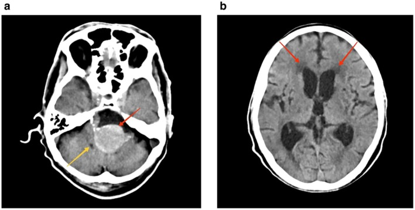
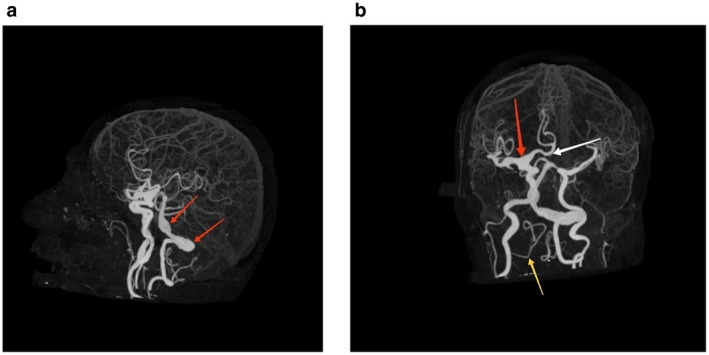
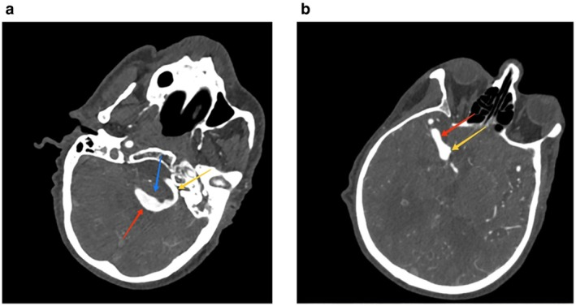

# Title
Obstructive Hydrocephalus Secondary to a Partially Thrombosed Fusiform Vertebral Artery Aneurysm with Extensive Cerebral Arterial Dolichoectasia: A Case Report and Review of Management Challenges

# Abstract
We present the case of a 55-year-old male with longstanding hypertension and dyslipidemia who developed progressive dizziness, headache, and vomiting, ultimately found to have obstructive hydrocephalus secondary to a partially thrombosed fusiform aneurysm of the left vertebral artery, accompanied by extensive dolichoectasia of both anterior and posterior cerebral circulations. Imaging revealed a hyperdense prepontine lesion compressing the fourth ventricle and marked vascular ectasia. The patient was managed symptomatically and with anticoagulation, which was discontinued after two months. He experienced partial symptomatic relief at three months. This case highlights the diagnostic and therapeutic complexities of hydrocephalus due to posterior circulation aneurysms, the implications of dolichoectatic vascular pathology, and the nuanced decision-making required for anticoagulation in the context of partially thrombosed aneurysms. Integration of advanced neuroimaging and individualized management strategies is emphasized.

# Introduction
Fusiform aneurysms of the vertebrobasilar system are rare, accounting for a minority of intracranial aneurysms, yet they pose significant clinical challenges due to their complex morphology, propensity for thrombosis, and association with dolichoectasia and mass effect on adjacent neural structures. Vertebrobasilar dolichoectasia (VBD) is characterized by elongation, dilatation, and tortuosity of the vertebral and basilar arteries, with an estimated prevalence of 0.05–5% in the general population, increasing with age and vascular risk factors such as hypertension and dyslipidemia[1,2]. Clinical manifestations range from ischemic stroke and cranial neuropathies to obstructive hydrocephalus, the latter resulting from direct compression of cerebrospinal fluid (CSF) pathways by aneurysmal or ectatic vessels[1,3]. Management is further complicated when aneurysms are partially thrombosed, as the risk of embolic events must be balanced against the potential for hemorrhagic complications, particularly when considering anticoagulation or endovascular intervention[4,5]. Here, we report a case of obstructive hydrocephalus due to a partially thrombosed fusiform vertebral artery aneurysm with extensive dolichoectasia, and review the relevant literature on diagnostic and therapeutic strategies.

# Case History/Examination
A 55-year-old male with a 10-year history of well-controlled hypertension and 5-year history of dyslipidemia presented with two episodes of vomiting over one day, preceded by two weeks of headache and nausea, and a month-long history of intermittent dizziness. On examination, he appeared ill but was hemodynamically stable, with a Glasgow Coma Scale (GCS) score of E4V5M6. Funduscopic examination revealed bilateral papilledema. Systemic examination was unremarkable, and basic laboratory investigations, including complete blood count and metabolic panel, were within normal limits.

# Differential Diagnosis, Investigations and Treatment
Given the subacute progression of symptoms and papilledema, an intracranial process causing raised intracranial pressure was suspected. Non-contrast CT of the brain demonstrated a hyperdense lesion anterior to the brainstem within the prepontine cistern, compressing the fourth ventricle and causing dilation of the lateral ventricles with periventricular seepage, consistent with obstructive hydrocephalus (Figure 1a, 1b).

> **Figure 1:** (a) Axial non-contrast CT showing a hyperdense lesion (red arrow) anterior to the brainstem within the prepontine cistern, compressing the fourth ventricle (yellow arrow). (b) Axial CT at a higher level demonstrates dilated lateral ventricles (red arrows) with periventricular lucency, indicative of hydrocephalus.

CT cerebral angiography revealed a partially thrombosed fusiform aneurysm of the left vertebral artery (2.8 cm diameter, 3.2 cm length), with a non-enhancing hypodense peripheral thrombus and a centrally opacified residual lumen. The right vertebral artery was hypoplastic. There was marked dolichoectasia of the V4 segment of the left vertebral and basilar arteries, with irregular dilatation and the left vertebral artery crossing the midline. Additional findings included absence of the left A1 segment of the anterior cerebral artery (ACA), with both ACAs arising from the right A1, and ectasia of the terminal right internal carotid, proximal right middle cerebral artery (MCA), and right ACA (Figure 2a, 2b).

> **Figure 2:** (a) Sagittal MRA showing dolichoectatic and fusiform dilatation of the vertebrobasilar system (red arrows). (b) Coronal MRA demonstrating ectatic right internal carotid artery (red arrow), bilateral ACA arising from right A1 (white arrow), and dolichoectatic basilar artery (yellow arrow).

Further evaluation with CT angiography of the chest and echocardiography excluded other sources of thrombus. No provoked cause for thrombosis was identified.

Management included symptomatic therapy with analgesics and antiemetics. After multidisciplinary discussion and patient counseling, anticoagulation with apixaban was initiated four days after presentation (10 mg for one week, then 5 mg twice daily), and discontinued after two months. Antihypertensive therapy was optimized. The patient declined further invasive intervention. At one month, he reported partial relief of headache, and at three months, his symptoms remained partially controlled.

# Conclusion and Results
This case illustrates the rare but clinically significant occurrence of obstructive hydrocephalus secondary to a partially thrombosed fusiform vertebral artery aneurysm with extensive dolichoectasia of both anterior and posterior circulations. Despite the complexity of the vascular pathology, a conservative approach with anticoagulation and symptomatic management resulted in partial symptomatic improvement and stabilization over three months.

# Discussion
Fusiform vertebral artery aneurysms and vertebrobasilar dolichoectasia represent a spectrum of non-saccular, complex vascular pathologies with significant risk for both ischemic and compressive complications[1,2]. The pathogenesis involves chronic hemodynamic stress, atherosclerosis, and intrinsic vessel wall abnormalities, often exacerbated by hypertension and dyslipidemia. Dolichoectatic vessels may compress adjacent neural structures or CSF pathways, leading to cranial neuropathies or hydrocephalus, as seen in this patient[1,3,6].

Hydrocephalus secondary to posterior circulation aneurysms is rare but well-documented, typically resulting from direct compression of the fourth ventricle or aqueduct by an aneurysmal mass or associated thrombus[3,7]. In this case, the hyperdense prepontine lesion on CT and the vascular findings on angiography were classic for a partially thrombosed fusiform aneurysm causing obstructive hydrocephalus. The presence of extensive dolichoectasia further complicated the clinical scenario, increasing the risk of both ischemic and hemorrhagic events.

Management of partially thrombosed intracranial aneurysms is controversial. Anticoagulation may reduce the risk of distal embolization from intra-aneurysmal thrombus but carries a risk of aneurysm growth or rupture, particularly in the absence of definitive aneurysm exclusion[4,5]. Endovascular options, such as flow diversion or stent-assisted coiling, are technically challenging in fusiform and dolichoectatic vessels, with variable outcomes[5,8,9]. In this case, the decision to initiate and subsequently discontinue anticoagulation was individualized, reflecting the lack of consensus and the need for shared decision-making in such complex cases.

Recent literature underscores the importance of advanced neuroimaging for diagnosis and follow-up, as well as the potential role of surgical or endovascular intervention in selected patients with progressive symptoms or high-risk features[2,5,8]. However, conservative management remains appropriate in stable patients or those declining intervention, as in our case.

The integration of multimodal imaging is critical for delineating the extent of vascular pathology and planning management. Figure 3 demonstrates the detailed vascular anatomy and the relationship of the aneurysm to adjacent structures.

> **Figure 3:** (a) Axial CT angiogram showing the partially thrombosed fusiform aneurysm of the left vertebral artery (red arrow), with adjacent dolichoectatic vessel (blue arrow) and hypoplastic right vertebral artery (yellow arrow). (b) Axial CT angiogram at a higher level highlighting the residual lumen of the aneurysm (red arrow) and the ectatic basilar artery (yellow arrow).

This case adds to the growing body of literature emphasizing the heterogeneity of presentation and the need for individualized, multidisciplinary management in patients with complex vertebrobasilar pathology and secondary hydrocephalus[1,2,5,8,9].

# Author Contributions
All authors contributed to the conception, data collection, analysis, and drafting of the manuscript. All authors approved the final version.

# Funding
No external funding was received for this work.

# Consent
Written informed consent was obtained from the patient for publication of this case report and accompanying images.

# Conflicts of Interest
The authors declare no conflicts of interest.

# References
1. Marshman LAG, Ball L, Jadun CK. Spontaneous bilateral carotid and vertebral artery dissections associated with multiple disparate intracranial aneurysms, subarachnoid hemorrhage and spontaneous resolution. Clinical Neurology and Neurosurgery. 2007;109(9):816-820. doi:10.1016/j.clineuro.2007.07.004
2. Huang L tian, Qin J, Tong X guang, Huang C jue. Cerebral bypass for symptomatic vertebrobasilar dolichoectasia. Neurosurgical Review. 2026;49(1). doi:10.1007/s10143-025-04099-4
3. Zhen X, Xu X, Sao X, Yu Y. Microvascular decompression for vertebrobasilar dolichoectasia-related primary trigeminal neuralgia: surgical approaches, technical considerations, and clinical outcomes. Neurosurgical Review. 2026;49(1). doi:10.1007/s10143-025-04057-0
4. Geisbush TR, Pulli B, Wolman DN, Pendharkar AV, Telischak NA. A case of recurrent aneurysm resulting from dual antiplatelet plus anticoagulation after confirmed aneurysm closure following coil-assisted flow diversion. Radiology Case Reports. 2022;17(11):4075-4078. doi:10.1016/j.radcr.2022.07.091
5. Kincaid KJ, Yu J, Echevarria FD, Simpkins AN. Giant Vertebrobasilar Fusiform Aneurysm Mass Effect Heralds Rapid in Situ Thrombosis and Ischemic Stroke in the Setting of Ulcerative Colitis. Journal of Stroke and Cerebrovascular Diseases. 2021;30(4):105621. doi:10.1016/j.jstrokecerebrovasdis.2021.105621
6. Vollherbst DF, Hohenstatt S, Schönenberger S, Bendszus M, Möhlenbruch MA. WEB as a combined support and embolization device in a giant partially thrombosed donut-shaped aneurysm. Journal of Clinical Neuroscience. 2020;75:210-212. doi:10.1016/j.jocn.2020.02.026
7. Lee WJ, Byun JS, Kim JK, Nam TK. Quantitative Computed Tomographic Volumetry after Treatment of a Giant Intracranial Aneurysm with a Pipeline Embolization Device. Yonsei Medical Journal. 2017;58(3):668. doi:10.3349/ymj.2017.58.3.668
8. Maingard J, Brooks M. ‘Donut’ basilar aneurysm with brainstem compression: Treatment using a flow diverting stent. Interventional Neuroradiology. 2016;22(3):266-269. doi:10.1177/1591019915626918
9. Segura-Lozano MA, Del Real-Gallegos MA, Mendoza-Lemus P, et al. Microvascular decompression for neurovascular compression syndromes secondary to vertebrobasilar dolichoectasia: a single-center retrospective analysis. Frontiers in Surgery. 2025;12. doi:10.3389/fsurg.2025.1668352
10. Obien ECF, Pua PJL, Maglinao AD, Lokin JK, Lagamayo PDJ. Ruptured Posterior Inferior Cerebellar Artery Aneurysm Presenting With Cerebellar Intraparenchymal and Intraventricular Hemorrhage: A Case Report. Cureus. Published online January 18, 2026. doi:10.7759/cureus.101781

---